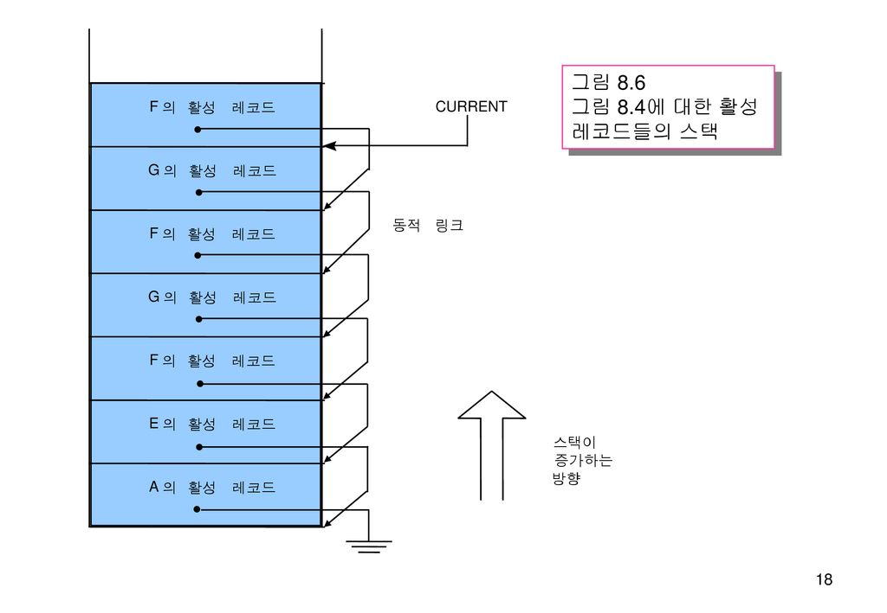

# [22-05-12] Clean Code 6, 8장 TIL

생성일: 2022년 5월 12일 오전 12:45
태그: 스터디

# Clean Code 6, 8장

- 2022-05-12
    - 6장 객체와 자료구조 , 8장 경계

**책에서 기억하고 싶은 내용을 써보세요.**

- 6장 객체와 자료구조
    - 사용자가 구현을 모른 채 자료의 핵심을 조작할 수 있어야 진정한 의미의 클래스다.
    - 자료를 세세하게 공개하기보다는 추상적인 개념으로 표현하는 편이 좋다.
    - 디미터 법칙
        - 휴리스틱. 모듈은 자신이 조작하는 개체의 속사정을 몰라야 한다는 법칙.
        
        → 클래스 C의 메서드 f는 다음과 같은 객체의 메서드만 호출해야한다
        
        - 클래스 C
        - f가 생성한 객체
        - f 인수로 넘어온 객체
        - C 인스턴스 변수에 저장된 객체
    - 잡종구조
        - 절반은 객체, 절반은 자료구조인 구조.
    - 자료 전달 객체 (자료 구조체, DTO Data Transfer Object)
        - 공개변수만 있고 함수가 없는 클래스.
        - 활성 레코드
            - DTO의 특수한 형태
            - save나 find와 같은 탐색 함수를 제공
    - 객체는 동작을 공개하고 자료를 숨긴다. 자료 구조는 별다른 동작 없이 자료를 노출한다.
        
        새로운 자료 타입을 추가하는 유연성이 필요하면 객체가 더 적합하다.
        
        새로운 동작을 추가하는 유연성이 필요하면 자료구조와 절차적인 코드가 더 적합하다.
        
    
- 8장 경계
    - 경계 인터페이스를 여기저기 넘기지 말라.
    - 학습테스트
        - 우리 자신을 위해 우리가 사용할 코드를 테스트하는 편이 바람직하다.
        - API를 사용하려는 목적에 초점을 맞추어 코드를 작성.
        - 학습 테스트는 투자하는 노력보다 얻는 성과가 더 크다.
    - 깨끗한 경계
        - 변경 시, 소프트웨어 설계가 우수할 때는 변경에 많은 투자와 재작업은 필요하지 않는다 → 설계의 중요성..!!
        - 통제하지 못하는 코드를 사용할 때는 너무 많은 투자를 하거나 향후 변경 비용이 지나치게 커지지 않도록 각별히 주의해야 한다. → 역시나 설계의 중요(??)

**오늘 읽은 소감은? 떠오르는 생각을 가볍게 적어보세요**

- 생각없이 조회/설정 함수를 추가하는 방법이 가장 나쁘다는 말을 보고, 만들었던 ~info 클래스 들이 생각났다. 내가 만들었던 건 객체가 아니라 단순한 정보 저장용 자료구조.. 혹은 잡종구조였구나 싶었다.
- 디미터 법칙. 하지 말라는거 다 하고 있는 중. 긴 도트문장 쓰면서 호출하기.. 특히 JSONObject 쓸 때 주체할 수 없이 늘어나곤 한다. 각각 따로 선언해서 나누는 건 한번만 쓰는데 또 선언하는게 신경쓰였고 그래서 고집부려 한번에 비교하거나 호출하다보면 정말 감당할수 없는 긴 호출문이 되곤 했다. 따로 선언했더라도 객체의 구조를 완전히 노출하는 거니까 (객체가 맞는지도 모르겠다)
- 활성 레코드를 찾아보니, 분명 교재에서 봤던 그림같았다. 들었다고 당당히 말할 수는 없지만 교재에서 모두 봤었는데.. 지난 걸 후회해서 뭘하나 싶지만 역시나 공부했다면 알고 넘어갔을 내용. 또는 알았으니 코드에도 잘 적용했을 내용
    - 막상 자료구조 책을 찾아보니 자료구조는 아니고 프로그래밍 언어론이었다.
    - 계속 봐야지 봐야지만 했는데, 사놓고 제대로 안봤던 교재를 읽어야겠다..
- 외부 API를 사용할 때 책에서 표현한 것 처럼 어떻게 호출해야하나 ? 를 책과 같은 방식으로는 크게 고민한 적이 없었던 것 같다.  그저 이걸 가져와서 어떻게 내가 쓰려는 기능으로 만들것인다.. (기능 구현 O, 구조 고민 X)
- 오늘 부분은 특히나 이렇게 해야한다~!인데, 예제를 보면 정말 잘 알겠다가도, 막상 하려고 하면 어떻게 해야할 지 막막할 것 같다. 설계가 중요하고, 설계를 잘 하면서 추후에 변경 비용을 줄이는 것이 좋다고 하는데, 급한 상황에 (바로 지금..) 그렇게 실천할 수 있을까 자신이 없다ㅠㅠ

**궁금한 내용이 있거나, 잘 이해되지 않는 내용이 있다면 적어보세요.**

- 디미터 법칙
    - 다른 객체가 어떠한 자료를 갖고 있는지 속사정을 몰라야 한다는 것을 의미
    - 직관적 이해를 위해 . 를 많이 사용하지 않음 - 객체의 구조를 알 수 있는 도트는 사용을 지양.
    - 함수에서 갤체 호출 시 객체의 구조가 확인되지 않도록. (객체 안에 객체가 포함된다면 포함된 객체는 뭔지 알 수 없게)
    - 디미터의 법칙은 결합도와 관련된 것이며, 객체의 내부 구조가 외부로 노출되는지에 대한 것이다.
    - [https://mangkyu.tistory.com/147](https://mangkyu.tistory.com/147)
    
- 활성레코드
    - 활성화 상태 : 단위 프로그램의 실행 시작부터 종료까지
    - 단위 활성화 : 실행 시간에 한 단위 프로그램이 표현된 상태
        - 코드부 + 활성화 레코드로 구성
        - 코드부 : 프로그램의 명령어로 구성, 고정크기로 프로그램 실행동안 애용이 변하지 않음
        - 활성화레코드 :  단위 활성화의 지역변수와 관련된 자료를 비롯한 프로그램 실행에 필요한 모든 정보를 가지고 있으며 실행에 따라 내용이 변함
            - 반환주소
            - 동적링크
            - 지역변수/매개변수/정적링크
            - 활성화 레코드의 크기는 동적/정적으로 결정됨.
            - 단위프로그램이 활성화되는 시점에서 크기가 결정되기도 함

출처 : 프로그래밍 언어론 교재

---

- [https://soniacomp.medium.com/자료구조-재귀호출-2657e4dcb6f8](https://soniacomp.medium.com/%EC%9E%90%EB%A3%8C%EA%B5%AC%EC%A1%B0-%EC%9E%AC%EA%B7%80%ED%98%B8%EC%B6%9C-2657e4dcb6f8)